= Ad Hoc Synchronization Considered Harmful
Weiwei Xiong; Soyeon Park; Jiaqi Zhang; Yuanyuan Zhou; Zhiqiang Ma; University of California, San Diego
:stem: latexmath
:toc: left

.About {author_1}
* University of Illinois at Urbana-Champaign

.About {author_5}
* Intel

.Abstract
****
* Many synchronizations in existing multi-threaded programs are implemented in
  an ad hoc way.
* The first part of this paper does a comprehensive characteristic study of ad
  hoc synchronizations in concurrent programs.
* By studying 229 ad hoc synchronizations in 12 programs of various types
  (server, desktop and scientific), including Apache, MySQL, Mozilla, etc., we
  find several interesting and perhaps _alarming_ characteristics:
1. #Every studied application uses ad hoc synchronizations.# +
   Specifically, there are 6–83 ad hoc synchronizations in each program.
2. #Ad hoc synchronizations are error-prone.# +
   _Significant percentages (22-67%) of these ad hoc synchronizations
   introduced bugs or severe performance issues._
3. #Ad hoc synchronization implementations are diverse and many of them cannot
   be easily recognized as synchronizations, i.e. have poor readability and
   maintainability.#

'''

* The second part of our work builds a tool called *SyncFinder* to
  automatically identify and annotate ad hoc synchronizations in concurrent
  programs written in C/C++ to assist programmers in porting their code to
  better structured implementations, while also enabling other tools to
  recognize them as synchronizations.
* Our evaluation using 25 concurrent programs shows that, on average,
  SyncFinder can automatically identify 96% of ad hoc synchronizations with 6%
  false positives.

'''

* We also build two use cases to leverage SyncFinder's auto-annotation.
* The first one uses annotation to detect 5 deadlocks (including 2 new ones)
  and 16 potential issues missed by previous analysis tools in Apache, MySQL
  and Mozilla.
* The second use case reduces Valgrind data race checker's false positive
  rates by 43-86%.
****

== 1 Introduction

* Synchronization plays an important role in concurrent programs.
* Recently, partially due to realization of multicore processors, much work
  has been conducted on synchronization in concurrent programs.
* For example, various hardware/software designs and implementations have been
  proposed for transactional memory \(TM) [37, 13, 30, 40] as ways to replace
  the cumbersome "lock" operations.
* Similar to TM, some new language constructs [46, 7, 12] such as Atomizer
  [12] have also been proposed to address the atomicity problem.
* On a different but related note, various tools such as AVIO [27], CHESS
  [31], CTrigger [36], ConTest [6] have been built to detect or expose
  atomicity violations and data races in concurrent programs.
* In addition to atomicity synchronization, condition variables and monitor
  mechanisms have also been studied and used to ensure certain execution order
  among multiple threads [14, 16, 22].

'''
 
* So far, most of the existing work has targeted only the synchronizations
  implemented in a modularized way, i.e., directly calling some primitives
  such as "lock/unlock" and "cond_wait/cond_signal" from standard POSIX thread
  libraries or using customized interfaces implemented by programmers
  themselves.
* Such synchronization methods are easy to recognize by programmers, or bug
  detection and performance profiling tools.

'''

* Unfortunately, besides modularized synchronizations, programmers also use
  their own ad hoc ways to do synchronizations.
* It is usually hard to tell ad hoc synchroniztions apart from ordinary
  thread-local computations, making it difficult to recognize by other
  programmers for maintenance, or tools for bug detection and performance
  profiling.
* We refer to such synchronization as _ad hoc synchronization_.
* If a program defines its own synchronization primitives as functional calls
  and then uses these functions throughout the program for synchronization,
  then we do not consider these primitives as ad hoc, since they are well
  modularized.

'''

* #Ad hoc synchronization is often used to ensure an intended execution order
  of certain operations.#
* #Specifically, instead of calling "cond_wait()" and "cond_signal()" or other
  synchronization primitives, programmers often use _ad hoc loops_ to
  synchronize with some shared variables, referred to as _sync variables_.#
* #According to programmers' comments, they are implemented this way due to
  either flexibility or performance reasons.#

'''

* Figure 1(a)(b)(c)(d) show four real world examples of ad hoc
  synchronizations from MySQL, Mozilla, and OpenLDAP.
* In each example, a thread is waiting for some other threads by repetitively
  checking on one or more shared variables, i.e. sync variables.
* Each case has its own specific implementation, and it is also not obviously
  apparent that a thread is synchronizing with another thread.

|===
a|
.Real world examples of ad hoc synchronizations.
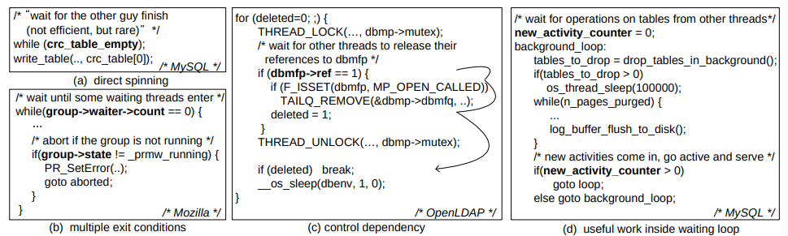

* Sync variables are highlighted using bold fonts.
* Example (a) directly spins on the sync variable; (b) checks more than one
  sync variables, (c) takes a certain control path to exit after checking a
  sync variable, (d) performs some useful work inside the waiting loop.
|===

'''

* Unfortunately, there have been few studies on ad hoc synchronization.
* It is unclear how commonly it is used, how programmers implement it, what
  issues are associated with it, whether it is error-prone or not.

=== 1.1 Contribution 1: Ad Hoc Synchronization Study

* In the first part of our work, we conduct a "forensic investigation” of 229
  ad hoc synchronizations in 12 concurrent programs of various types (server,
  desktop and scientific), including Apache, MySQL, Mozilla, OpenLDAP, etc.
* The goal of our study is to understand the characteristics and implications
  of ad hoc synchronization in existing concurrent programs.

'''

* Our study has revealed several interesting, _alarming_ and quantitative
  characteristics as follows:

'''

.(1) Every studied concurrent program uses ad hoc synchronization.
* More specifically, there are 6-83 ad hoc synchronizations implemented using
  ad hoc loops in each of the 12 studied programs.
* The fact that programmers often use ad hoc synchronization is likely due to
  two primary reasons:
1. Unlike typical atomicity synchronization, when coordinating execution
   order among threads, the intended synchronization scenario may vary from
   one to another, making it hard to use a common interface to fit every need
   (more discussion follows below and in Section 2).
2. Performance concerns make some of the heavy-weight synchronization
   primitives less applicable.

.#(2) Although almost all ad hoc synchronizations are implemented using loops, the implementations are diverse, making it hard to manually identify them among the thousands of computation loops.#
* For example, Figure 1(a) directly spins on a shared variable; Figure 1(b)
  has multiple exit conditions; Figure 1(c) shows the exit condition
  indirectly depends on the sync variable and needs complicated calculation to
  determine whether to exit the loop; Figure 1(d) synchronizes on program
  states and performs useful work while checking whether the remote thread has
  changed the states or not.
* Such characteristic may partially explain why programmers use ad hoc
  synchronizations.
* More discussion and examples are in Section 2.

.(3) Ad hoc synchronizations are error-prone.
* Table 1 shows that among the five software systems we studied, significant
  percentages (22-67%) of ad hoc synchronizations introduced bugs.
* Although some experts may expect such results, our study is among the first
  to provide some quantitative results to back up this observation.

[%autowidth]
.Percentages of ad hoc synchronizations that had introduced bugs according to the bugzilla databases and changelogs of the applications.
|===
|Apps.			|#ad hoc sync	|#buggy sync
|Apache			|33				|7 (22%)
|OpenLDAP		|15				|10 (67%)
|Cherokee		|6				|3 (50%)
|Mozilla-js		|17				|5 (30%)
|Transmission	|13				|8 (62%)
|===

'''

* Ad hoc synchronization can easily introduce deadlocks or hangs.
* As shown on Figure 2, Apache had a deadlock in one of its ad hoc
  synchronizations.
* It holds a mutex while waiting on a sync variable "queue_info\->idlers".
* Figure 3 shows another deadlock example in MySQL, which has never been
  reported previously.
* More details and the real world examples are in Section 2.

|===
a|
.A deadlock introduced by an ad hoc synchronization in Apache.
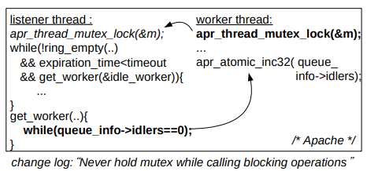
|===

|===
a|
.A deadlock caused by a circular wait among three threads (This is a new deadlock detected by our deadlock detector leveraging SyncFinder's auto-annotation).
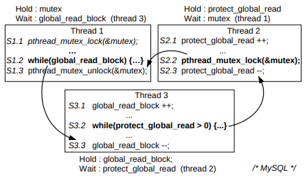

* Thread 2 is waiting at S2.2 for the lock to be released by thread 1; thread
  1 is waiting at S1.2 for thread 3 to decrease the counter at S3.3; and
  thread 3 is waiting at S3.2 for thread 2 to decrease another counter at S2.3.
|===

'''

* Because they are different from deadlocks caused by locks or other
  synchronization primitives, deadlocks involving ad hoc synchronizations are
  very hard to detect using existing tools or model checkers [11, 43, 24].
* These tools cannot recognize ad hoc synchronizations unless these
  synchronizations are annotated manually by programmers or automatically by
  our SyncFinder described in section 1.2.
* For the same reason, it is also hard for concurrency testing tools such as
  ConTest [6] to expose these deadlock bugs during testing.
* Furthermore, ad hoc synchronizations also have problems interacting with
  modern hardware's weak memory consistency model and also with some compiler
  optimizations, e.g. loop invariant hoisting (discussed further in Section
  2).

'''

* By studying the comments associated with ad hoc synchronizations, we found
  that some programmers knew their implementations might not be safe or
  optimal, but they still decided to keep their ad hoc implementations.

.(4) Ad hoc synchronizations significantly impact the effectiveness and accuracy of various bug detection and performance tuning tools.
* Since most bug detection tools cannot recognize ad hoc synchronizations,
  they can miss many bugs related to those synchronizations, as well as
  introduce many false positives (details and examples in Section 2).
* For the same reason, performance profiling and tuning tools may confuse ad
  hoc synchronizations for computation loops, thus generating inaccurate or
  even misleading results.

== 2 Ad Hoc Synchronization Characteristics

* To understand ad hoc synchronization characteristics, we have manually
  studied 12 representative applications of three types (server, desktop and
  scientific/graphic), as shown on Table 2.
* Two inspectors separately investigated almost every line of source code and
  compared the results with each other.
* As shown on Table 3, in our initial study, we missed a few ad hoc
  synchronizations, most of which are those implemented using interlocked or
  nested goto loops (e.g., the example in Figure 4).
* Fortunately, our automatic identification tool, SyncFinder, discovers them,
  and we were able to extend our manual examination to include such
  complicated types.

|===
a|
[caption="Table {counter:table-number}. "]
.The number of ad hoc synchronizations in concurrent programs we studied.
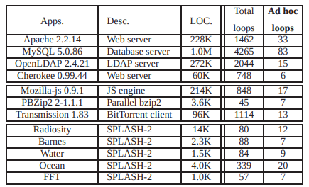

* Ad hoc sync is implemented with an ad hoc loop using shared variables (i.e.,
  sync variables) in it.
|===

|===
a|
[caption="Table {counter:table-number}. "]
.Ad hoc sync loops missed by human inspections.
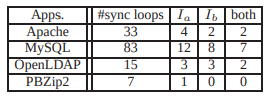

* Two inspectors, stem:[I_a] and stem:[I_b], investigate the same source code
  separately.
* Most of the sync loops missed by both inspectors (i.e., those in Apache and
  MySQL) are interlocked or nested goto loops.
* Others (in OpenLDAP) are for-loops doing complicated useful work and
  checking synchronization condition in it, like one in Figure 1(d).
|===

|===
a|
.An ad hoc synchronization missed in our manual identification process of our characteristic study but is identified by our auto-identification tool, SyncFinder.
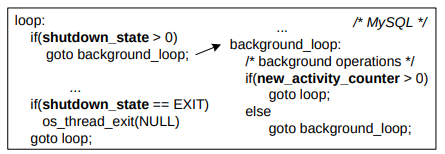
* The interlocked "goto" loops can easily be missed by manual identification
  (Figure 1(d) shows more detailed code).
|===

.Threats to Validity.
* Similar to previous work, characteristic studies are all subject to the
  validity problem.
* Potential threats to the validity of our characteristic study are the
  representativeness of applications and our examination methodology.
* To address the former, we chose a variety of concurrent programs, including
  four servers, three client/desktop concurrent applications as well as five
  scientific applications from SPLASH-2, all written in C/C++, one of the
  popular languages for concurrent programs.
* These applications are well representative of server, client/desktop-based
  and scientific applications, three large classes of concurrent programs.

'''

* In terms of our examination methodology, we have examined almost every line
  of code including programmers' comments.
* This was an immensely time consuming effort that took three months of our
  time.
* To ensure correctness, the process was repeated twice, each time by a
  different author.
* Furthermore, we were also quite familiar with the examined applications,
  since we have modified and used them in many of our previously published
  studies.

'''

* Overall, while we cannot draw any general conclusions that can be applied to
  all concurrent programs, we believe that our study does capture the
  characteristics of synchronizations in three large important classes of
  concurrent applications written in C/C++.

=== Finding 1: Every studied application uses ad hoc synchronizations. More specifically, there are 6–83 ad hoc synchronizations in each of the 12 studied programs.

* As shown in Table 2, ad hoc synchronizations are used in all of our
  evaluated programs, and some programs (e.g. MySQL) even use as many as 83 ad
  hoc synchronizations.
* This indicates that, in the real world, it is not rare for programmers to
  use ad hoc synchronizations in their concurrent programs.
* While we are not 100% sure why programmers use ad hoc synchronizations,
  after studying the code and comments, we speculate there are two primary
  reasons.
* The first is because there are diverse synchronization needs to ensure
  execution order among threads.
* #Unlike atomicity synchronization that shares a common goal, the exact
  synchronization scenario for order ensurance may vary from one to another,
  making it hard to design a common interface to fit every need (more
  discussion in Finding 2).#
* The second reason is due to performance concerns on synchronization
  primitives, especially those heavyweight ones implemented as system calls.
* #If the synchronization condition can be satisfied quickly, there is no need
  to pay the high overhead of context switches and system calls.#
* Such performance justifications are frequently mentioned in programmers'
  comments associated with ad hoc synchronization implementations.

'''

* #While ad hoc synchronizations are seemly justified, are they really
  worthwhile?#
* #What are their impact on program correctness and interaction with other
  tools?#
* #Can they be expressed using some common, easy-to-recognize synchronization
  primitives?#
* We will dive into these questions in our finding 3 and 4, trying to shed
  some lights into the tradeoffs.

=== Finding 2: Ad hoc synchronization is diverse.

* Table 4 further categorizes ad hoc synchronizations from several
  perspectives.
* Some real world examples for each category can be found in Figure 1 and
  Figure 5.

|===
a|
[caption="Table {counter:table-number}. "]
.Diverse ad hoc synchronizations in concurrent programs we studied.
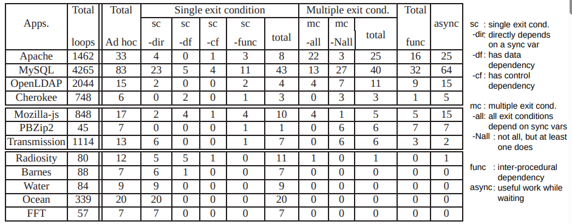
1. The number of exit conditions in synchronization loops are various (_sc_
   vs. _mc_)
2. There can be multiple, different types of dependency relations between sync
   variables and loop exit conditions (_-dir_, _-df_, _-cf_, _-func_)
3. Some synchronization loops do useful work with asynchronous condition
   checking (_async_).
|===

|===
a|
.Examples of various ad hoc synchronizations.
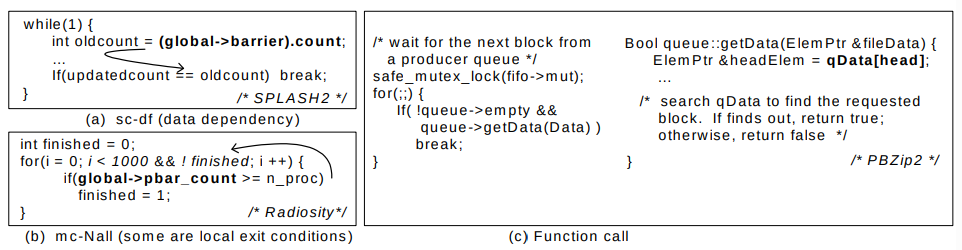

* A sync variable is highlighted using a bold font.
* An arrow shows the dependency relation from a sync variable to a loop-exit
  condition.
* The examples of other ad hoc categories are shown on Figure 1.
|===

.(i) Single vs. multiple exit conditions:
* Some ad hoc synchronization loops have only one exit
  condition{empty}footnote:[A condition that can break the execution out of a
  loop.].
* We call such sync loops _sc_ loops.
* Unfortunately, many others (up to 86% of ad hoc synchronizations in a
  program) have more than one exit condition.
* We refer to them as _mc_ loops.
* In some of them (referred to as _mc_all_), all exit conditions are satisfied
  by remote threads.
* In the other loops (referred to as _mc_Nall), there are also some local exit
  conditions such as time-outs, etc., that are independent of remote threads
  and can be satisfied locally.

.(ii) Dependency on sync variables:
* The simplest ad hoc synchronization is just directly spinning on a sync
  variable as shown on Figure 1(a).
* In many other cases (50-100% of ad hoc synchronizations in a program), exit
  conditions indirectly depend on sync variables via data dependencies
  (referred to as _df_, Figure 5(a)), control dependencies (referred to as
  _cf_, (Figure 1(c)), even inter-procedural dependencies (referred to as
  _func_, Figure 5(c)).

.(iii) Asynchronous synchronizations (referred as async):
* In some cases (77% of ad hoc synchronizations in server/desktop applications
  we studied), a thread does not just wait in synchronization.
* Instead, it also performs some useful computations while repetitively
  checking sync variables at every iteration.
* For example, in Figure 1(d), a MySQL master thread does background tasks
  like log flushing until a new SQL query arrives (by checking
  _new_activity_counter_).

=== Finding 3: Ad hoc synchronizations can easily introduce bugs or performance issues.

* After studying the 5 applications listed in Table 1, we found that 22-67% of
  synchronization loops previously introduced bugs or performance issues.
* These high issue rates are alarming, and, as a whole, may be a strong sign
  that programmers should stay away from ad hoc synchronizations.

'''

* For each ad hoc synchronization loop, we use its corresponding file and
  function names to find out in the source code repository if there was any
  patch associated with it.
* If there is, we manually check if the patch involves the ad hoc sync loop.
* We then uses this patch's information to search the bugzilla databases and
  commit logs to find all relevant information.
* By examining such information as well as the patch code, we identify whether
  the patch is a feature addition, a bug not related to synchronization, or a
  bug caused exactly by the ad hoc sync loop.
* We only count the last case.

'''

* #Besides deadlocks (as demonstrated in Figure 2 and 3), ad hoc
  synchronization can also introduce other types of concurrency bugs.#
* In some cases, an ad hoc synchronization fails to guarantee an expected
  order and lead to a crash because the exit condition can be satisfied by a
  third thread unexpectedly.
* Due to space limitations, we do not show those examples here.

'''

* In addition to bugs, ad hoc synchronizations can also introduce performance
  issues.
* Figure 6 shows such an example.
* #In this case, the busy wait can waste CPU cycles and decrease throughput.#
* #Therefore, programmers revised the synchronization by adding a sleep inside
  the loop.#

|===
a|
.An ad hoc synchronization in MySQL was revised by programmers to solve a performance problem.
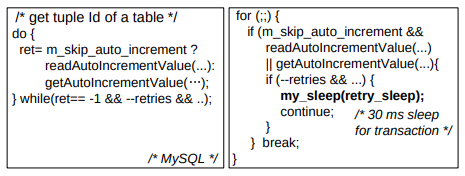
|===

'''

* Ad hoc synchronizations also have problematic interactions with modern
  hardware's relaxed consistency models [5, 28, 45].
* #These modern microprocessors can reorder two writes to different locations,
  making ad hoc synchronizations such as the one in Figure 1(a) fail to
  guarantee the intended order in some cases.#
* #As such, experts recommended programmers to stay away from such ad hoc
  synchronization implementations, or at least implement synchronizations
  using atomic instructions instead of just simple reads or writes [5, 28,
  45].#

'''

* #To make things even worse, ad hoc synchronizations also have problematic
  interactions with compiler optimizations such as loop invariant hoisting.#
* #Programmers should avoid such optimizations on sync variables, and ensure
  that waiting loops always read the up-to-date values instead of the cached
  values from registers.#
* #As a workaround, programmers may need to use wrapping variable accesses with
  function calls [3].#
* All of these just complicate programming as well as software testing and
  debugging.

'''

* Interestingly, some programmers are aware of the above ad hoc
  synchronization problems but still use them.
* We study the 63 comments associated with ad hoc synchronizations in MySQL,
  Apache, and Mozilla.
* #As illustrated in Table 5, programmers sometimes mentioned better
  alternatives, but they still chose to use their ad hoc implementations for
  _flexibility_.#
* #In some cases, they explicitly indicated their preference for the
  _lightness and simplicity_ of ad hoc spinning loops, especially when the
  synchronizations were expected to rarely occur or rarely need to wait long.#
* #Also, programmers often explicitly stated their assumptions/expectation in
  comments about what remote threads should do correspondingly, since ad hoc
  synchronizations are complex and hard to understand.#

|===
a|
[caption="Table {counter:table-number}. "]
.Observations in programmers' comments on ad hoc synchronization from Apache, Mozilla, and MySQL.
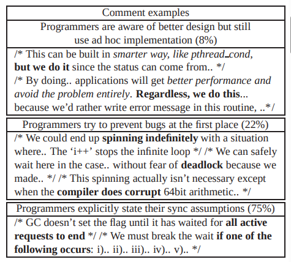
* We study 63 comments associated with ad hoc synchronizations.
|===

=== Finding 4: Ad hoc synchronizations can significantly impact the effectiveness and accuracy of concurrency bug detection and performance profiling tools.

* #As mentioned earlier, since existing concurrency bug (deadlock, data race)
  detection tools cannot recognize ad hoc synchronizations, they will fail to
  detect bugs that involve such synchronizations (e.g. deadlock examples shown
  on Figure 2 and 3).#
* In addition, they can also introduce many false positives.
* #It has been well known that most data race detectors incur high false
  positives due to ad hoc synchronizations.#
* Such false positives come from two sources:
1. #_Benign data races on sync variables_#: typically an ad hoc synchronization
   is implemented via an intended data race on sync variables. +
   Figure 7(a) shows such a benign data race reported by Valgrind [33] in
   MySQL.
2. #_False data races that would never execute in parallel due to the execution
   order guaranteed by ad hoc synchronizations_#: +
   For example, in Figure 7(b), the two threads are synchronized at S2 and S3,
   which guarantees the correct order between S1 and S4's accesses to
   _q_info\->pools_. +
   S1 and S4 would never race with each other. +
   However, most data race checkers cannot recognize this ad hoc
   synchronization and, as a result, incorrectly report S1 and S4 as a data
   race.

|===
a|
.False positives in Valgrind data race detection due to ad hoc synchronizations
image::figure-07.png[]
|===

'''

* Synchronization is also a big performance and scalability concern because
  time waiting at synchronization is wasted.
* #Unfortunately, existing work in synchronization cost analysis [25, 32] and
  performance profiling [29] cannot recognize ad hoc synchronizations, and
  therefore the synchronizations can easily be mistaken as computation.#
* As a result, the final performance profiling results may cause programmers
  to make less optimal or even incorrect decisions while performance tuning.

.Replacing with synchronization primitives.
* #Our findings above reveal that ad hoc synchronization is often harmful in
  several respects.#
* #Therefore, it is desirable that programmers use synchronization primitives
  such as _cond_wait_, rather than ad hoc synchronization.#
* Figure 8 shows how ad hoc synchronization can be replaced with a well-known
  synchronization primitive, POSIX _pthread_cond_wait()_.
* Note that it may not always be straightforward to use existing
  synchronization primitives to replace all ad hoc synchronizations, because
  existing synchronization primitives may not be sufficient to meet the
  diverse synchronization needs as well as the performance requirements, as
  discussed in Finding 1.

|===
a|
.Replacing ad hoc synchronizations with synchronization primitives using condition variables.
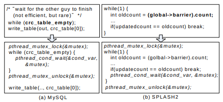

* (a) shows the re-implementation of ad hoc synchronization in Figure 1(a);
  (b) is for Figure 5(a).
|===

== 7 Conclusions and Limitations

* In this paper, we provided a quantitative characteristics study of ad hoc
  synchronization in concurrent programs and built a tool called SyncFinder to
  automatically identify and annotate them.
* By examining 229 ad hoc synchronization loops from 12 concurrent programs,
  we have found several interesting and alarming characteristics.
* Among them, the most important results include: all concurrent programs
  have used ad hoc synchronizations and their implementations are very diverse
  and hard to recognize manually.
* Moreover, a large percentage (22-67%) of ad hoc loops in these applications
  have introduced bugs or performance issues.
* They also greatly impact the accuracy and effectiveness of bug detection and
  performance profiling tools.
* In an effort to detect these ad hoc synchronizations, we developed
  SyncFinder, a tool that successfully identifies 96% of ad hoc
  synchronization loops with a 6% false positive rate.
* SyncFinder helps detect deadlocks missed by conventional deadlock detection
  and also reduce data race detector's false positives.
* Many other tools and research projects can also benefit from SyncFinder.
* For example, concurrency testing tools (e.g., CHESS [31]) can leverage
  SyncFinder's auto-annotation to force a context switch inside an ad hoc sync
  loop to expose concurrency bugs.
* Similarly, performance tools can be extended to profile ad hoc
  synchronization behavior.

'''

* All work has limitations, and ours is no exception:
1. SyncFinder requires source code. +
   However, this may not significantly limit SyncFinder's applicability since
   it is more likely to be used by programmers instead of end users.
2. Due to some implementation issues, SyncFinder still misses 1-3 ad hoc
   synchronizations. +
   Eliminating them would require further enhancement to some of our analysis
   (such as alias analysis, etc.)
3. Even though SyncFinder's false positive rates are quite low, for some use
   cases that are sensitive to false positives, programmers would need to
   manually examine the identified ad hoc synchronization or leverage some
   execution synthesis tools like ESD [49] to help identify false positives.
4. For our characteristic study, we can always study a few more applications,
   especially of different types.
