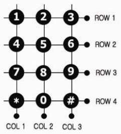

# Keypad NT - 804AN - BE

- Legend(Character) type: Alpha-Numeric, Body/Key color: White, Character color BLACK

## Specification

- Contact rating: 20mA, 24V DC

- Contact resistance: 200 ohm max

- Life: 1,000,000 cycles per key

- Operating Temperature: -20℃ to +60℃

· Storage Temperature: -40℃ to +65℃

## Application

- 정보기기나 통신기기

- PDA, 휴대폰, 키보드, 각종, 가정용 전화기

· 자동화 장비용, 산업용기기

### Wiring Diagram

#### Circuit Diagram

#### Output arrangement

|Output pin no|Symbol|
|-|-|
|1|COL 2|
|2|ROW 1|
|3|COL 1|
|4|ROW 4|
|5|COL 3|
|6|ROW 3|
|7|ROW 2|
