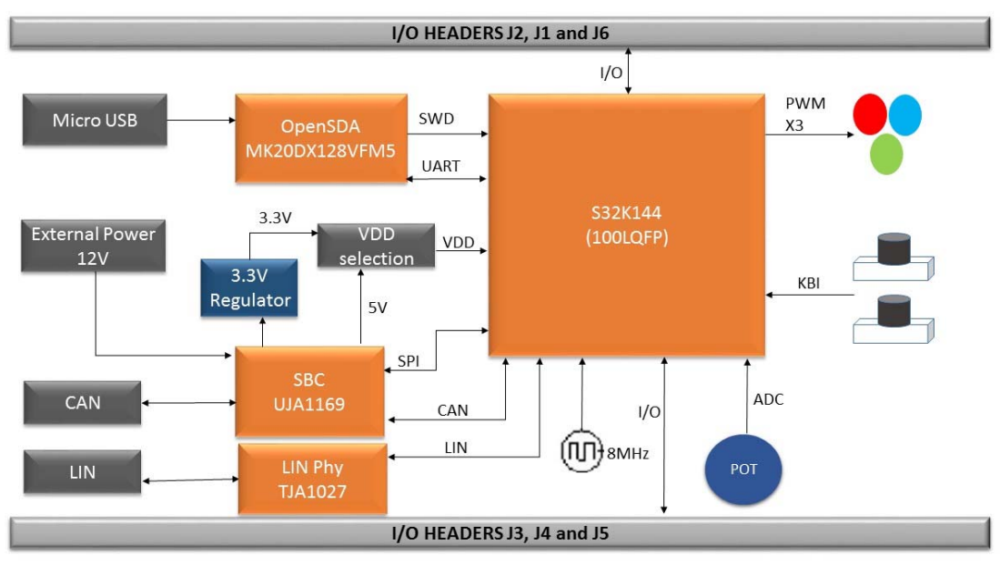
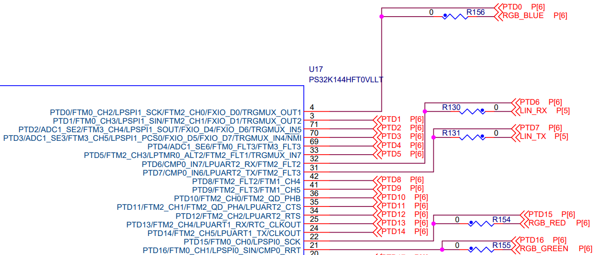
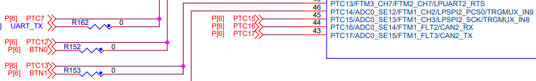
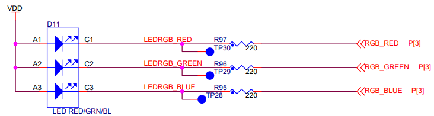
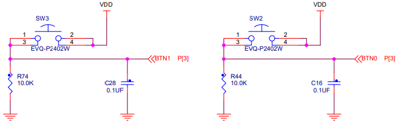

# S32K144EVB-Q100

## Notes and Block Diagram

1. Unless Otherwise Specified

    - All resistors are in ohms, 1% and 5%

    - All capacitors are in uF, 10%, 20% and 5%

    - All voltages are DC

    - All polarized capacitors are aluminum electrolytic

2. Interrupted lines coded with the same letter or letter combinations are electrically connected.

3. Device type number is for reference only.

    - The number varies with the manufacturer.

4. Special signal usage:

    - \_B Denotes - Active-Low Signal

    - <> or [] Denotes - Vectored signals

5. Interpret diagram in accordance with American National Standards Institute specifications, current revision, with the exception of logic block symbology.

## S32K144 MCU

- RGB LED

    

- USER BUTTONS

    

## I/O Headers

- RGB LED

    

- USER BUTTONS

    
