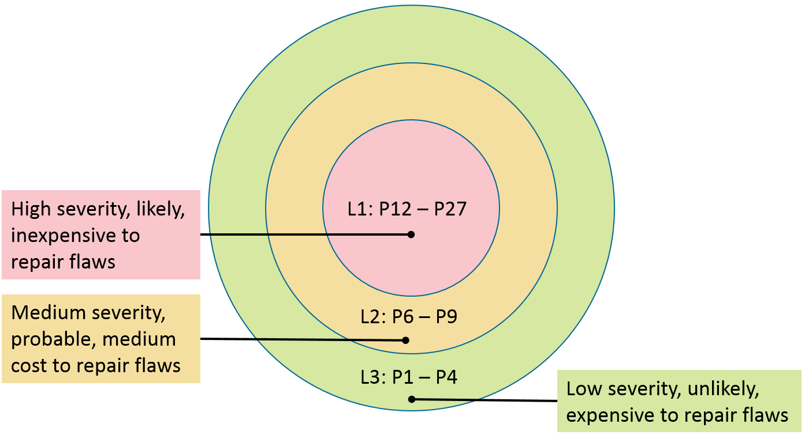

= How this Coding Standard is Organized
Created by Admin, last updated by David Svoboda on Sep 03, 2025
:table-caption!:
:toc:

* This coding standard is organized into 15 chapters containing rules in
  specific topic areas followed by four appendices.
* Appendix A contains the bibliography.
* Appendix B lists the definitions of terms used throughout the standard.
* Appendix C lists the undefined behaviors from the C Standard, Annex J, J.2
  [ISO/IEC 9899:2011], numbered and classified for easy reference.
* These numbered undefined behaviors are referenced frequently from the rules.
* Appendix D lists unspecified behaviors from the C Standard, Annex J, J.2
  [ISO/IEC 9899:2011].
* These unspecified behaviors are occasionally referenced from the rules as
  well.

'''

* Most rules have a consistent structure.
* Each rule in this standard has a unique identifier, which is included in the
  title.
* The title and the introductory paragraphs define the rule and are typically
  followed by one or more pairs of noncompliant code examples and compliant
  solutions.
* Each rule also includes a risk assessment, related guidelines, and a
  bibliography (where applicable).
* Rules may also include a table of related vulnerabilities.
* The recommendations in this wiki are organized in a similar fashion.

== Risk Assessment

* #Each guideline in the CERT C Coding Standard contains a risk assessment
  section that attempts to provide software developers with an indication of
  the potential consequences of not addressing a particular rule or
  recommendation in their code (along with some indication of expected
  remediation costs).#
* This information may be used to prioritize the repair of rule violations by
  a development team.
* The metric is designed primarily for remediation projects.
* It is generally assumed that new code will be developed to be compliant with
  the entire coding standard and applicable recommendations.

'''

* #Each rule and recommendation has an assigned _priority_.#
* Priorities are assigned using a metric based on Failure Mode, Effects, and
  Criticality Analysis (FMECA) [link:[IEC 60812]].
* Three values are assigned for each rule on a scale of 1 to 3 for severity,
  likelihood, and remediation cost.

'''

Severity::
* How serious are the consequences of the rule being ignored?
+
[%autowidth]
|===
|Value	|Meaning	|Examples of Vulnerability

|1		|Low		|Denial-of-service attack, abnormal termination
|2		|Medium		|Data integrity violation, unintentional information
                     disclosure
|3		|High		|Run arbitrary code
|===

Likelihood::
* How likely is it that a flaw introduced by violating the rule can lead to an
  exploitable vulnerability?
+
[%autowidth]
|===
|Value	|Meaning

|1		|Unlikely
|2		|Probable
|3		|Likely
|===

Detectable::
* Can a static analysis tool automatically determine if code violates this
  guideline with high accuracy and precision?

Repairable::
* Can an automated repair tool reliably fix an alert by making local changes,
  and can the repair be guaranteed not to break the code even if the alert is
  a false positive?
* (There might exist a small set of cases that the tool cannot repair, but the
  tool can reliably identify these cases.)

'''

* In the context of automated repair, the phrase "break the code" requires
  more elaboration.
* We posit that noncompliant and un-repaired code currently works for some
  subset of inputs, which we would deem "expected inputs".
* To be noncompliant, there must also exist "unexpected inputs" that trigger
  the noncompliant code to do something unintended.
* This might be undefined behavior or simply unexpected or counter-intuitive
  behavior, such as producing an inaccurate mathematical result.
* For a repair to not break the code, the repaired code must exhibit the same
  behavior for all the expected inputs and only change behavior for some or
  all of the unexpected inputs.
* The changed behavior could be to signal an error condition, using whatever
  error-handling mechanism the code has adopted.

'''

* This definition of a repair differs from a refactor, which we define as a
  modification of the code that changes no behavior.
* That is, the refactored code behaves on both expected and unexpected inputs
  the same as the un-refactored code.
* If code can be automatically refactored to comply with a rule without
  changing its behavior on any inputs, that rule is automatically repairable
  (even though any such modification would be a refactor rather than a repair).

'''

* An automated repair tool does not need to know the developer's intent of any
  lines of code when repairing them.
* But it can be informed about idiosyncratic general details about the source
  code's conventions.
* One example would be whether assertions are disabled in production code.
* Knowing of such details is necessary if the repair tool must make code
  changes involving assertions.

'''

* The Detectable and Repairable questions are combined into a single
  Remediation Cost metric value that ranges from 1 to 3, 

[%autowidth]
|===
|Automatically...	|Not Repairable	|Repairable

|Not Detectable		|1		|2
|Detectable		|2		|3
|===

* #This Remediation Cost metric value, along with the Priority and Severity
  values are then multiplied together for each rule.#
* This product provides a measure that can be used in prioritizing the
  application of the rules.
* The products range from 1 to 27, although only the following 10 distinct
  values are possible: 1, 2, 3, 4, 6, 8, 9, 12, 18, and 27.
* Rules and recommendations with a priority in the range of 1 to 4 are Level
  3 rules, 6 to 9 are Level 2, and 12 to 27 are Level 1.
* #The following are possible interpretations of the priorities and levels.#

.*Priorities* and *Levels*
[%autowidth]
|===
|Level	|Priorities	|Possible Interpretation

|L1	|12, 18, 27	|High severity, likely, inexpensive to repair
|L2	|6, 8, 9	|Medium severity, probable, medium cost to repair
|L3	|1, 2, 3, 4	|Low severity, unlikely, expensive to repair
|===

* #Specific projects may begin remediation by implementing all rules at a
  particular level before proceeding to the lower priority rules, as shown in
  the following illustration:#

* #Recommendations are not compulsory and are provided for information
  purposes only.#

== Bibliography

* Most guidelines have a small bibliography section that lists documents and
  sections in those documents that provide information relevant to the
  guideline.
